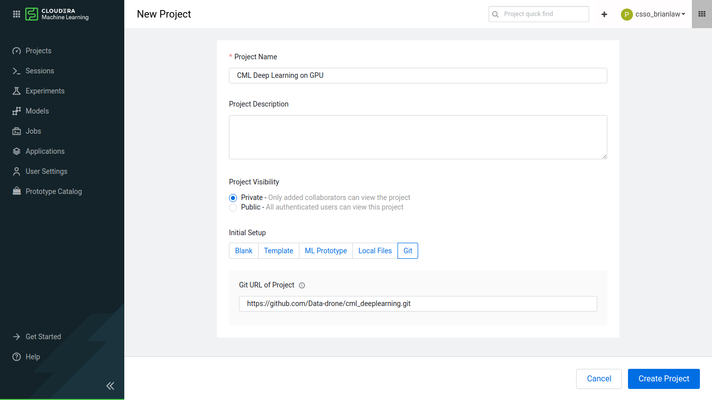
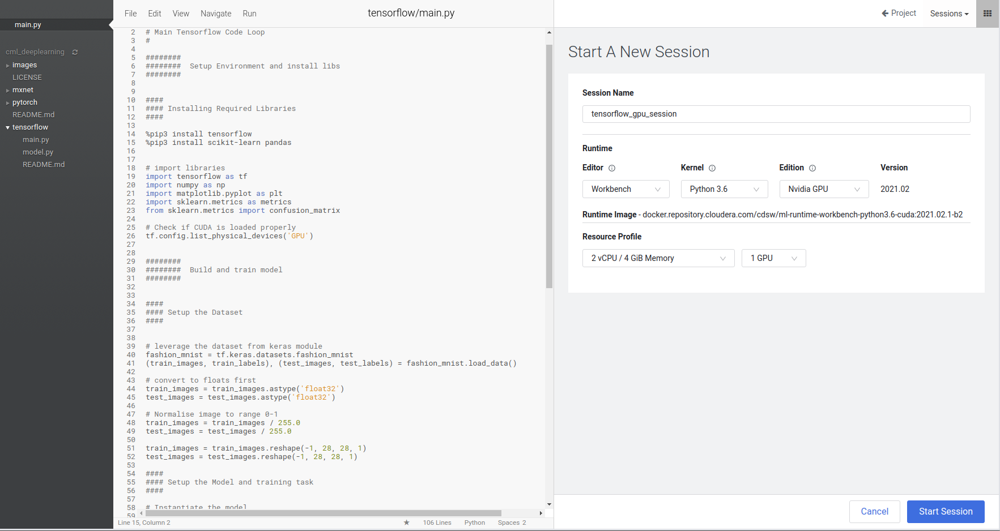
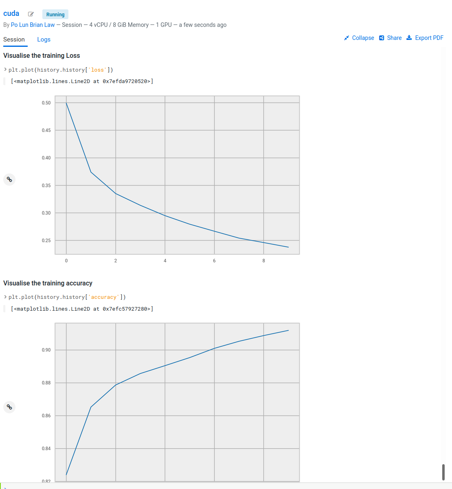

# Deep Learning with CML Runtimes with Cloudera Machine Learning

Support Repo for blog article on CUDA Runtimes in CML

## Introduction

In our previous article, we demonstrated how to setup sessions in Cloudera Machine Learning (CML)'s to access Nvidia GPUs for accelerating Machine Learning Projects.
When leveraging GPUs, a lot of the time can be lost wrangling with drivers, CUDA versions and custom engines. With CML, we will handle it for you.

To show off how easily Data Scientists can get started with GPU compute on our platform, I will show three ways to go from 0 to CUDA trained model with CML.

## Scenario

As the demonstrative example, I will use a Computer Vision classification example. We will train models on how to classify fashion items leveraging the FashionMnist Dataset. MNIST, a handwritten digits classification task, has been the Computer Vision 101 example for years but with the compute capability that we now have access to and the advanced deep learning models that we have access to it has become a trivial and uninteresting.

Fashion MNIST is a tougher classification challenge that can be more illustrative. Fashion MNIST provides 10 different classes of clothing items for the algorithm to classify with 10,000 samples each.

## Libraries

For this example I will show PyTorch, Tensorflow and MXNet which are backed by Facebook, Google and AWS respectively.

See the relevant subfolders for each library:
- pytorch
- tensorflow
- mxnet

## Tutorial

Each folder contains a `main.py` function that contains the code to install the libraries, load the data, setup the network and train the model. I will go over the tensorflow one here.

Firstly, git clone the repo into a new project.

Once it has all loaded, you will land into the project page.

From there you can create a new session. In the following example, I will use the native CML IDE but you can also leverage Jupyter as well. Notice that I have set GPUs to 1. Is it possible to leverage multiple GPUs. That, however, adds complexity to the code and requires careful consideration for how we train the model so I will not go over that here.

With our IDE and session available, we now need to install the relevant libraries. In the `main.py` script in my tensorflow subfolder you can see the pip commands to install the libraries at the top

Run these two lines to get the libraries installed. This can be done by selecting the two lines and hitting `Ctrl+Enter` (To check)

With the libraries installed, we can run import the libraries and run a quick check to make sure that tensorflow is correctly leveraging gpu.

---
**NOTE** Libraries like tensorflow are normally packaged and released onto pypi and conda channels for specific CUDA versions down to the point release. CUDA 11.0 libraries may have issues with CUDA 11.1 for example. 

If there is a mismatch between CUDA version and what the packaged library was compiled with it maybe necessary to compile the library for your specific flavour of CUDA from source.

---

To see how much we are using GPU I will open a terminal session and load `nvidia-smi` tool to track usage. Use `nvidia-smi -l` to open a refreshing tracker for GPU utilisation

Now we can run the rest of the script and watch our model train

When our model is trained we can look at the model training results to see how good our model is.

## More to come

In this post, we reviewed how to start up a GPU enabled Cloudera Machine Learning Session and showed off how to leverage the GPU for deep learning applications. 